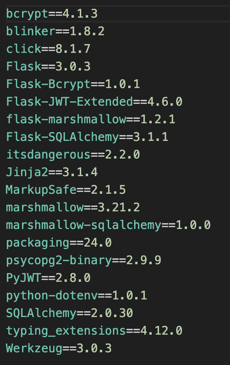

# T2A2-NBA-Card-Manager-API

## R1 - The problem this app will solve and how it will does this

Sport card collecting, specifically NBA cards, is a very popular hobby within Australia. The hobby broke out into the mainstream during the pandemic where thousands of individuals began to collect and sell various kinds of NBA cards. During this time, listings for cards on auction applications such as EBay and Facebook Marketplace increased by 300%. However, despite this, physical store locations which specalise in sport card collecting have rapidly closed. In Sydney alone, there is no specific physcial store front which sells and is committed to purely sport card sales. This lack of a gathering place has hindered the hobbys growth within Australia as there is no place for individuals who are in invested in this hobby to meet and grow the community to levels it is at in other parts of the world such as America. This can be examplified in the fact that in Australia, over 60% of the individuals who were exposed to the hobby during its heightened popularity in the pandemic have since stepped away.Currently, individuals invested in the hobby must rely on social media applications such as Facebook, Ebay and Instagram to both discuss and potentially sell/trade cards in their collection. This can become a hinderence as from personal experience, managing different lines of communication on multiple different applications can become exhausting, especially for individuals who are looking for specific rare cards. This inconvenience may have attibuted to lesser individuals being invested in the hobby. 

The solution to this is a centralised application which solely designed to serve the various needs of individuals who are invested in NBA card hobby. This API serves as the foundation for this application and provides individuals with a multitude of features to both grow the NBA card collecting communitiy, but also to simplify trading/selling practices within the hobby. It does this by providing three main features. This includes a blogging feature, a feature to display all current cards in an individuals collection, as well as the building blocks to a fully fledged auction house where users can both place their cards on auction and other users can place bids. These features reflect the three core pillars of the card collecting hobby. Having these abilities in a centralised application will propel the hobbies growth in areas where physical meeting is limited and ultimately provide convience to all individuals who are both seasoned card collectors as well as individuals looking to enter the hobby for the first time.

## R3 - Explantion of the third party services, packages and dependencies utilised to create the API

### Main third party services, packages and dependencies utilised 

### Flask

Flask is a web framework designed for Python which allows developers to create and manage web appplications efficiently. It is a WSGI framework, meaning that it acts as a gateway for web servers to pass request to web applications or other frameworks. It relies on the WSGI external library as well as the Jinja2 template engine to operate. It is out of the box, meaning users can install the package straight to Python and automatically begin building frameworks. In this sense, Flask has been utilised as the foundation of the API and handles the routes, requests and responses.

### Flask_JWT_Extended

This is an extension of the Flask framework and is designed to allow JSON Web Token Authentication and Authorization. It does this by creating an instance of these tokens once called upon. These tokens can be utilisied to automatically authenitcate individuals trying to access specific routes within the API.

### Bcrypt

Bcrypt is a library which is designed to increase the security of data which is stored within a RDBMS. It is particularly used to protect passwords and other sensitive information by hashing this information in a which ensures it is securarly stored. It is extremely important to hash all sensitive information, particularly sensitive information provided by clients who utilise the API, to ensure third party breaches do not occur and all client information remains secure.

### SQLAlchemy & Psycopg2

SQLAlchemy is the core package which allows Python to interact with the PostgreSQL database which is connected to the application. This is due to the fact that it is created based upon the object-relational mapping (ORM) principle. Essentially, SQLAlchemy allows developers to query the database in a pythonic manner by treating the models and schemas of the database as Python classess and objects. Building upon this, the tables which are created witin the database are mapped to Python classes, while the rows which are found within those tables are mapped to instances of those classes. In order for SQLAlchemy to effectively interact with the PostgreSQL database, it is necessary to connect the flask application to the database. This is completed by utilising the Psycopg2 library which is designed to facilitate the connection between the database and the Flask application by acting as an adapted between the two.

### Marshmallow

Marshamallow faciliates the exchange of information between the classes and models which are created through SQLAclhemy, to JSON readible data which the API can serve to a client. It does this through three key processes which include serilisation (conversion of objects to native Python data types which can be expressed as JSON), deserialisation (conversion of JSON back to complext Python data types) and validation (ensures the data which is being serliased/deserialised conforms to the rules outlined in the schema which has been created by the developer). Without Marshmallow, it would be extremely difficult/complicated to serve routes with the appropirate data in a JSON format.

### A Complete List of the Dependencies Can be Found Below:

## R4 - Benefits and Drawbacks of the API's underlying database system

The database system which has been utilised to for this application includes PostgreSQL. It is a relational database management system which is open source. It is most commonly utilised to build API projects and provides an amptiude of benefits to developers who utilise it in their projects. However, there are some certain drawbacks which inhibit its overally effectivness in certain circumstances.

### Benefits

- **Extensibility:** A major overall benefit of PostgreSQL is it's ability to be highly extensible. Developers have the ability to extend their database they are currently working with which means that if a developer needs to utilise a feature which is not currently supported by PostgreSQL out of the box, the developer can implement and create this feature themselves. This provides a huge amount of flexibility to developers as they can completly finetune all aspects of their database and ensure they are hitting all crucial aspects of their projects. It also ensures that complex requirments which may be imposed by clients have a higher chance of being implemented successfully in a more efficient manner.

- **Open Source:** Another major benefit of PostgreSQL is the fact that it is open source. Open source tools such as PostgreSQL provide a cost effective option for developers as it is completely free to utilise. This factor has lead to PostgreSQL to being utilised in both personal and commercial development settings. The nature of it being open source means that it holds a dedicated base of developers who both maintain and alievate bugs in an efficient manner, but there is a vast community of users who are able to assit individuals who are learning PostgreSQL or who have encounted a blocker while utilising it. This improves effiency in development time for developers at all stages in their development journeys.

- **Security Features:** PostgreSQL has a rich set of security features built into it and these features are designed to to uphold all authorisation of data. There are three key security features at this level which ensure that individuals who do not hold the requisite permissions to access data within the a created database are forbidden from doing so. These include Role-Based Access Control (Allows system admin administrators to manage permissions of users through the use of access roles and grants, which dictate who can access and modify data), Table and Column-Level Permissions (Allow system administrators to give specific table level permissions to restrict who can access schemas of databases) and Row-Level Security (permissions are set to enable access to specific rows within a table).

### Drawbacks

- **Slow Performance:** Unfortunately, when working with large data sets, it is fair to say that PostgreSQL performs relatively slower when compared to other database management systems. This can be attributed to the fact that PostgreSQL is a relational database management system and must read every table in a line by line nature to extract relevent data which may or may not match the query whih is being inputted by the user. This slow standard inhibits PostgreSQL's ability to be utilised in commercial settings where data sets are likely to be huge in nature. It also has the ability to hinder security as backup techniques are more difficult and less efficient to implement. 

- **Complexity:** Due to its advanced features and ability to express many different types of data and relationships, PostgreSQL can be considered to be a complex database to manage. This is specifically true for individuals who are just being exposed to interacting with databases for the first time. As previously stated, there is a huge community who is dedicated to assiting individuals in need of assitance, however, the sheer amount of features that PostgreSQL provides users may be daunting and lead to individuals avoiding utilising the database management system all together. 