# T2A2-NBA-Card-Manager-API

## R1 - The problem this app will solve and how it will does this

Sport card collecting, specifically NBA cards, is a very popular hobby within Australia. The hobby broke out into the mainstream during the pandemic where thousands of individuals began to collect and sell various kinds of NBA cards. During this time, listings for cards on auction applications such as EBay and Facebook Marketplace increased by 300%. However, despite this, physical store locations which specalise in sport card collecting have rapidly closed. In Sydney alone, there is no specific physcial store front which sells and is committed to purely sport card sales. This lack of a gathering place has hindered the hobbys growth within Australia as there is no place for individuals who are in invested in this hobby to meet and grow the community to levels it is at in other parts of the world such as America. This can be examplified in the fact that in Australia, over 60% of the individuals who were exposed to the hobby during its heightened popularity in the pandemic have since stepped away.Currently, individuals invested in the hobby must rely on social media applications such as Facebook, Ebay and Instagram to both discuss and potentially sell/trade cards in their collection. This can become a hinderence as from personal experience, managing different lines of communication on multiple different applications can become exhausting, especially for individuals who are looking for specific rare cards. This inconvenience may have attibuted to lesser individuals being invested in the hobby. 

The solution to this is a centralised application which solely designed to serve the various needs of individuals who are invested in NBA card hobby. This API serves as the foundation for this application and provides individuals with a multitude of features to both grow the NBA card collecting communitiy, but also to simplify trading/selling practices within the hobby. It does this by providing three main features. This includes a blogging feature, a feature to display all current cards in an individuals collection, as well as the building blocks to a fully fledged auction house where users can both place their cards on auction and other users can place bids. These features reflect the three core pillars of the card collecting hobby. Having these abilities in a centralised application will propel the hobbies growth in areas where physical meeting is limited and ultimately provide convience to all individuals who are both seasoned card collectors as well as individuals looking to enter the hobby for the first time.

## R3 - Explantion of the third party services, packages and dependencies utilised to create the API

### Main third party services, packages and dependencies utilised 

### Flask

Flask is a web framework designed for Python which allows developers to create and manage web appplications efficiently. It is a WSGI framework, meaning that it acts as a gateway for web servers to pass request to web applications or other frameworks. It relies on the WSGI external library as well as the Jinja2 template engine to operate. It is out of the box, meaning users can install the package straight to Python and automatically begin building frameworks. In this sense, Flask has been utilised as the foundation of the API and handles the routes, requests and responses.

### Flask_JWT_Extended

This is an extension of the Flask framework and is designed to allow JSON Web Token Authentication and Authorization. It does this by creating an instance of these tokens once called upon. These tokens can be utilisied to automatically authenitcate individuals trying to access specific routes within the API.

### Bcrypt

Bcrypt is a library which is designed to increase the security of data which is stored within a RDBMS. It is particularly used to protect passwords and other sensitive information by hashing this information in a which ensures it is securarly stored. It is extremely important to hash all sensitive information, particularly sensitive information provided by clients who utilise the API, to ensure third party breaches do not occur and all client information remains secure.

### SQLAlchemy & Psycopg2

SQLAlchemy is the core package which allows Python to interact with the PostgreSQL database which is connected to the application. This is due to the fact that it is created based upon the object-relational mapping (ORM) principle. Essentially, SQLAlchemy allows developers to query the database in a pythonic manner by treating the models and schemas of the database as Python classess and objects. Building upon this, the tables which are created witin the database are mapped to Python classes, while the rows which are found within those tables are mapped to instances of those classes. In order for SQLAlchemy to effectively interact with the PostgreSQL database, it is necessary to connect the flask application to the database. This is completed by utilising the Psycopg2 library which is designed to facilitate the connection between the database and the Flask application by acting as an adapted between the two.

### Marshmallow

Marshamallow faciliates the exchange of information between the classes and models which are created through SQLAclhemy, to JSON readible data which the API can serve to a client. It does this through three key processes which include serilisation (conversion of objects to native Python data types which can be expressed as JSON), deserialisation (conversion of JSON back to complext Python data types) and validation (ensures the data which is being serliased/deserialised conforms to the rules outlined in the schema which has been created by the developer). Without Marshmallow, it would be extremely difficult/complicated to serve routes with the appropirate data in a JSON format.

### A Complete List of the Dependencies Can be Found Below:


## R4 - Benefits and Drawbacks of the API's underlying database system

The database system which has been utilised to for this application includes PostgreSQL. It is a relational database management system which is open source. It is most commonly utilised to build API projects and provides an amptiude of benefits to developers who utilise it in their projects. However, there are some certain drawbacks which inhibit its overally effectivness in certain circumstances.

### Benefits

- **Extensibility:** A major overall benefit of PostgreSQL is it's ability to be highly extensible. Developers have the ability to extend their database they are currently working with which means that if a developer needs to utilise a feature which is not currently supported by PostgreSQL out of the box, the developer can implement and create this feature themselves. This provides a huge amount of flexibility to developers as they can completly finetune all aspects of their database and ensure they are hitting all crucial aspects of their projects. It also ensures that complex requirments which may be imposed by clients have a higher chance of being implemented successfully in a more efficient manner.

- **Open Source:** Another major benefit of PostgreSQL is the fact that it is open source. Open source tools such as PostgreSQL provide a cost effective option for developers as it is completely free to utilise. This factor has lead to PostgreSQL to being utilised in both personal and commercial development settings. The nature of it being open source means that it holds a dedicated base of developers who both maintain and alievate bugs in an efficient manner, but there is a vast community of users who are able to assit individuals who are learning PostgreSQL or who have encounted a blocker while utilising it. This improves effiency in development time for developers at all stages in their development journeys.

- **Security Features:** PostgreSQL has a rich set of security features built into it and these features are designed to to uphold all authorisation of data. There are three key security features at this level which ensure that individuals who do not hold the requisite permissions to access data within the a created database are forbidden from doing so. These include Role-Based Access Control (Allows system admin administrators to manage permissions of users through the use of access roles and grants, which dictate who can access and modify data), Table and Column-Level Permissions (Allow system administrators to give specific table level permissions to restrict who can access schemas of databases) and Row-Level Security (permissions are set to enable access to specific rows within a table).

### Drawbacks

- **Slow Performance:** Unfortunately, when working with large data sets, it is fair to say that PostgreSQL performs relatively slower when compared to other database management systems. This can be attributed to the fact that PostgreSQL is a relational database management system and must read every table in a line by line nature to extract relevent data which may or may not match the query whih is being inputted by the user. This slow standard inhibits PostgreSQL's ability to be utilised in commercial settings where data sets are likely to be huge in nature. It also has the ability to hinder security as backup techniques are more difficult and less efficient to implement. 

- **Complexity:** Due to its advanced features and ability to express many different types of data and relationships, PostgreSQL can be considered to be a complex database to manage. This is specifically true for individuals who are just being exposed to interacting with databases for the first time. As previously stated, there is a huge community who is dedicated to assiting individuals in need of assitance, however, the sheer amount of features that PostgreSQL provides users may be daunting and lead to individuals avoiding utilising the database management system all together.

- **Resource Intensive:** When compared to other databases, PostgreSQL can be considered to be extremely resource intensive and has the ability to bottleneck database performance through overuse of CPU power and memory usage. This is can be extremely prevelent when working with large amounts of data and queries which commonly utilise the * indicator to search the entire regulary. When working with huge data sets, the need for speed is quite important and may lead to developers in investing in more hardware to improve the bottlenecks which are created by PostgreSQL. Depending on the context, this can be quite expensive to maintain.

## R5 - Explaination the features, purpose and functionalities of the object-relational mapping system (ORM) used in this app

The ORM which has been utilised to faciliate the creation of the application is SQLAlchemy. SQLAlchemy allows for the interaction between the database and the Flask application by translating tables and rows in a database to classes and instances in python to ensure seemless integration and communication. In this application, SQLAlchemy is utilised in a multiude of different ways for different purposes. The instance in which it is utilised and the purpose of why it is being used for each circumstance can be found below:

### Creation of database models/instances tables/rows:

#### Designing the databade models/tables

By utilising SQLAlchemy, database tables can be created straight from Python. This is achieved by utilising Python classes to represent each table which is stored in the database. Below is how you would design a class to represent a model of a particular table. In this case, the card model is being displayed: 

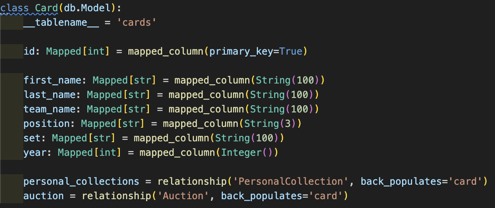

In this example, the tables paramaters are being designed the class. The class name is named Card and the paramaters being passed into the class is ```db.model```. This is to examplify to the class that it should have behaviors which are akin to a table in a database. Following on from this, the name in which the table will be called is denoted as a value of the ```__tablename__``` attribute.  In this instance, the table which is based off this model will be called ```'cards'```. 

Following on from this, the attributes of the model are defined. Firstly, the primary key is denoted as the ```id``` attribute which holds the ```primary_key=True``` method to denote that it should be a seriel int type which is unique across all entries in the table. Following on from this, there are 6 other attributes found withiin this table. 

Following on from the attributes, the last two entires in the model are defining the various kinds of relationships this model/table has with other model/tables in the database. In this instance, the model has a one to many relationship with both the ```personal_collections``` and the ```auction``` table in the database. Both these tables utilise the ```id``` attribute of the card models as foregein keys thus solidfying the relationship. 

The purpose of creating these models is to ensure that Flask and the PostgreSQL database are able to effectivly communicate, and there is ease to the developer creating the API to utilise the models of the database as classes in Python to allow easier manipulation in a development sense. 

#### Creation of the tables within the database

SQLAlchemy provides specific ability to create tables in the database straight from Python. The following example shows the syntax for creating tables utilising SQLAlchemy:


By utilising this syntax, any model which has been imported into the file where this command is being executed will be created within the database with the same structure which has been defined in the creation of the model class.

The ```db.drop_all()``` method will delete all tables from the database which is connected to the Flask app. While the ```db.create_all()``` method will create all tables based on the imported model class connected to the file where this method is being executed.

 Again the purpose of this is to create ease to the developer as well as build upon the ability to create model classes, as this feature would be essentially useless if a developer was not able to actually create the table from the model which has been designed

 #### Creation of rows/instances

 SQLAlchemy provides the ability to create instances of the classes which are created to represent the database model, and treat these instances as rows once they are add the table within the database. An example of the syntax which completes this is found below:

 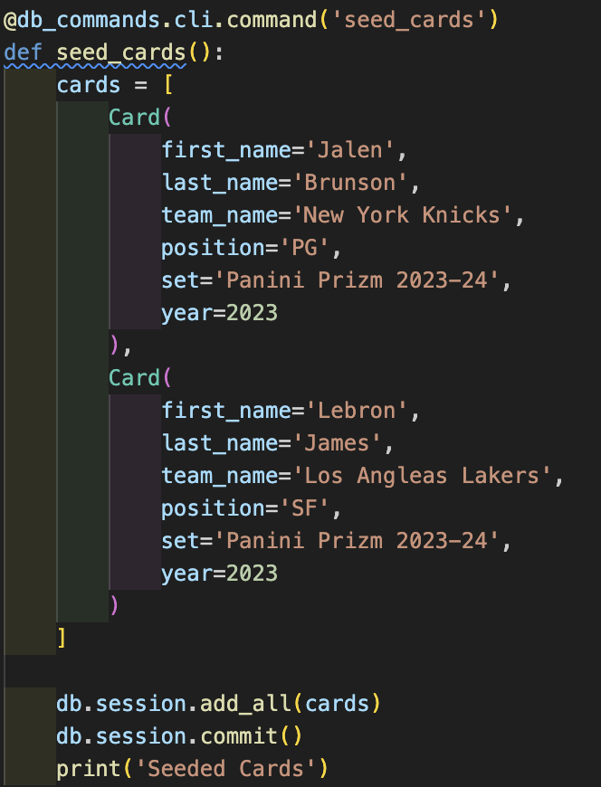

 As you can see, the ```Card()``` method is called to create an instance of the ```Class Card```. The attributes that are being added to the instance are direct components of those that were created during classes creation. Once the user has finished creating the instance, they will pass the name of the instance to the ```db.session.add_all()``` method. This method will open a session which can be defined as a sort of work space where changes to the database that are pending are held in a waiting area. To effectively add these change to the database, the ```db.session.commit()``` method must be called. This method will close the session and add the changes to the database.

A culmination of the past three code example can be examplified below:


As you can see, the cards table has been created utilising the class model as the schema for the table. The instances of that class which were created and added to the database are also found and located within the classes table. As such, this processes examplifies how the utilisation of SQLAlchemy has assisted the faciliation of web applications in Flask.

## R6 - ERD Model of Database and description of how models have aided the database design

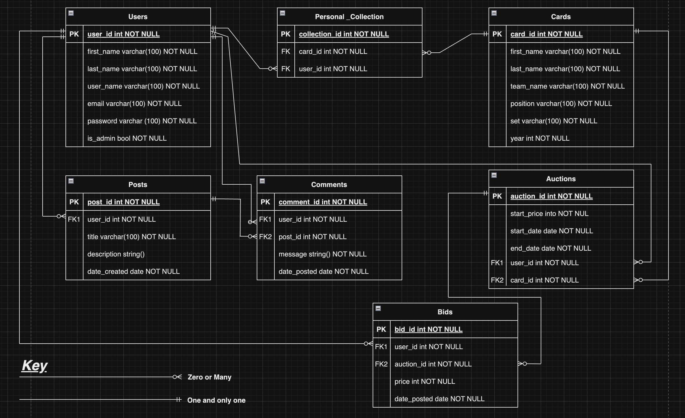

The above is the entity relationship diagram that was created priot to any code being completed for thos API. This API consists of 7 different tables which include Users, Posts, Comments, Cards, Personal_Collections, Auctions and Bids. Each of these tables have some sort of relationship with other tables throughout the database. The table with the most relationships with other tables is the User tables. This is done with a specific purpose. The purpose of this app is to faciliate user communication between different users in the NBA card hobby, and every feature implemented is user centric. As such, all tables besides the Cards table form a relationship to the users table. Going from users to other tables, there is a zero or many relationship relationship as users can have multiple instances of every type of instance in the outgoing tables. For example, a user can have zero or many posts, bids, auctions, comments, auctions and/or instances of personal_collections within the database. However, going back to the users table, there is a one and only one relationship as each of these instances can only have one user attached to each instance.

Utilising the users table as the foundation of the database is key for the optimal performance of the application and is needed for the application to effectively operate.

__Below is a table which expresses the relationships which are found in the database:__

### Relationships of the database

__Table One__ | __Relationship__| __Table Two__
--- | --- | --- |
Users | Zero or Many | Posts
Posts | One and only one | Users
Users | Zero or Many | Auctions
Auctions | One and only one  | Users
Users | Zero or Many | Bids
Bids | One and only one| Users
Users | Zero or Many | Comments
Comments | One and only one | Users
Users | Zero or Many | Personal_Collection
Personal_Collection | One and only one| Users
Auctions | Zero or Many | Bids
Bids | One and only one | Auctions
Cards | Zero or Many | Personal_Collection
Personal_Collection | One and only one | Cards
Comments | Zero or Many | Posts
Posts | One and only one | Comments

As you can see the relationships in this database are quite complex with most of the relationshis relating from one table to the users table. However, there are other key relationships where it would be reasonable to assume a relationship in a real circumstances. This occurs in both the Auctions to Bids table and the Posts to Comments table. The type of relationships which are present are a zero to many from the hierachy table (Posts, Auctions) to the lower tables (Comments, Bids). There is a one and only relationship in return on these tables. 

Furthermore, all tables within the database are normalised, meaning that each table is utilised to represent one kind of data input and there is no overlap between tables and entities which are entered into the table are not entirely dependent on the primary key. The need for normalisation is extremely important as it aids in reducing reduncy of data inputs, improvment of daya integrity as well as enhanced query performance. All tables conform the third normal form of normalisation and are open to the advantages that this brings. Below is an explanation of how the Personal_Collection table may look in all forms of normalisation. 

### Personal_Collection Table

### First Normal Form

#### Personal Collections

__ID__ | __Player Name__| __Set__| __Year__ | __Username__|
--- | --- | --- |--- | --- |
1|Lebron James|Panini Prizm|2024|Andrios17
2|Lebron James|National Treasures|2003|Andrios17
3|Jalen Brunson|Panini Prizm|2020|Hello123
4|Mikal Bridges|NBA Hoops|2023|Andrios17

This table conforms to the first normal form as each attribute is atomic and contains only single value per row. On top of this, each row is unique and idenifble by the primary key. However, as you can see there is overlap of information that should belong in different tables and it can be broken down further in more tables to avoid data reduency and improve data integrity.

### Second Normal Form

#### Personal Collections 

__ID__ | __Player Name__| __Set__| __Year__ |__User_id__|
--- | --- | --- |--- |--- |
1|Lebron James|Panini Prizm|2024| 1
2|Lebron James|National Treasures|2003| 1
3|Jalen Brunson|Panini Prizm|2020| 2
4|Mikal Bridges|NBA Hoops| 2023 | 1

#### Users

__ID__ | __User Name__|
--- | --- |
1| Andrios17
2| Hello 123

This table conforms to the second normal form as it follows the same structure as the first normal form, however, in this instance there a removal of data that there are applicable in multiple rows and are instead placed in a different table. In this instance, this is the user name attribute which has now been placed in a different table. The username attribute which was in place previously has now been moved to a different table and a relationship is created between the two tables through the creation of a foreign key in the personal collections table which references the users table. However, this can be improved upon further to improve performance and improve the normalisation process.

### Third Normal Form

#### Personal Collections 

__ID__ | __User Id__| __Card ID__|
--- | --- | --- |
1|1|1
2|1|2
3|2|3
4|1|4

#### Cards

__ID__ | __First Name__| __Last Name__| __Set__ |__Team Name__|__Position__|__Year__|
--- | --- | --- |--- |--- |--- |--- |
1|Lebron|James|Panini Prizm|Los Angleas Lakers|SF|2024
2|Lebron|James|National Treasures|Cleveland Cavaliers|SF|2023
3|Jalen|Brunson|Panini Prizm|New York Knicks|PG|2024
4|Mikal|Bridges|NBA Hoops|Pehnoix Suns|SG|2023

#### Users

__ID__ | __First Name__| __Last Name__| __User Name__ |__Email__|__Password__|__Is_Admin__|
--- | --- | --- |--- |--- |--- |--- |
1|Alexander|Andriopoulos|Andrios17|alexander.andriopoulos@gmail.com|#@$%^@@^|T
2|John|Smith|Hello123|John.Smith@hotmail.com|!@#$$^&*%&|F

All tables now conform to the third normal form of data normalisation. All entities which relate to a specific kind of data are now found in each of their own tables and there is no overlap of data found in the personal collections table. Relationships which are formed between the other two tables in the personal collections table are only established by calling upon the primary keys of other tables in the database. Columns which are not dependent on the primary keys have been removed. Through the creation of these new tables, it allows for more attributes to be added which are semenatically key and relevent to that table. For example, users table has been expanded upon to include information which is extremely relevent. This table can now be utilised to create relationships with other tables in the database which rely upon users. The personal collection table has been shrunk to only include the primary key identifier along with foregein keys which link the tables to relevent data. Search query optimsation is now extremely efficient as a user can query the personal collection table to effectively find all entries which correlate to the users appropiratly. 

Following this practice removes the need for dependencies on data sanisation and interpretation as queries can be utilised to effectively view all data associated with the personal collections table, thus the creation of an effective and effcient database can be implemented.

## R8 - Endpoints of the API

### Users

### Register Users

__Verb__: POST

__Path__: /users/register

__Header__: N/A

__Body__: Users must enter a valid email address, a password which holds a minimum of 10 characters, their first name, last name and a unique username. 

__Response__: A success message will be returned when there is a successful registration of a user with a ```201``` response

__Error__: Errors occur when a user tries to enter an email address or username which is already stored in the database or their password is invalid.

__Success__:

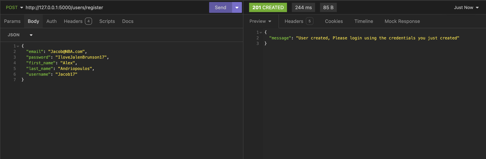

__Error__:

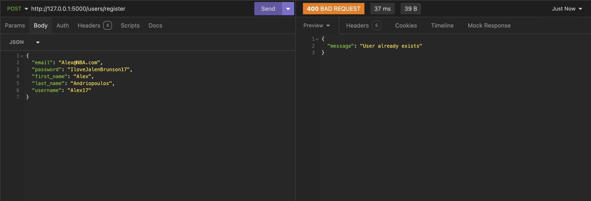

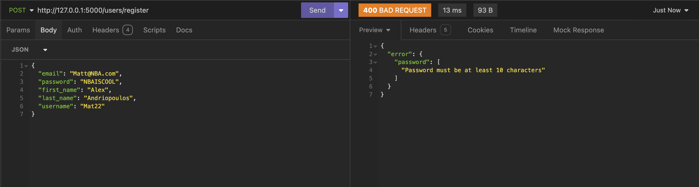

### Login

__Verb__: POST

__Path__: /users/login

__Header__: N/A

__Body__: Users must enter a valid email address, and password associated with a user in the database.

__Response__: A JWT will be returned to the user with a ```200``` response

__Error__: Errors occur when a user tries the wrong combination of an email/password to an associated user in the database.

__Success__:

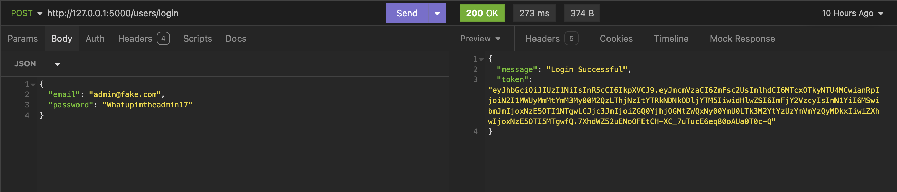

__Error__:

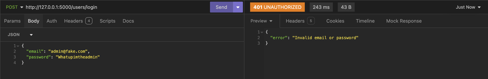

### Get all registered users

__Verb__: GET

__Path__: /users

__Header__: Valid JWT belonging to a user with admin privledges

__Body__: N/A

__Response__: A view of all registered excluding sensitive information such as password with a ```200``` response

__Error__: An error occurs when a user without admin privledges tries to access this route

__Success__:


__Error__:

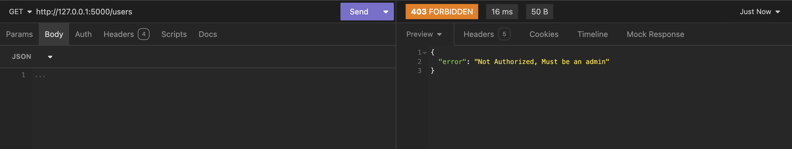

### Get a specific user

__Verb__: GET

__Path__: /users/<int: id>

__Header__: Valid JWT belonging to a user with admin privledges

__Body__: N/A

__Response__: A view of a specific user details excluding sensitive information such as password with a ```200``` response.

__Error__: An error occurs when a user without admin privledges tries to access this route

__Success__:

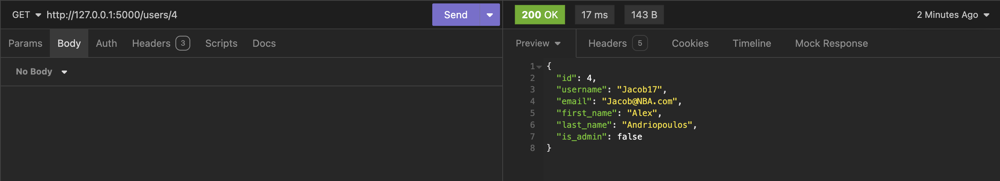

__Error__: 

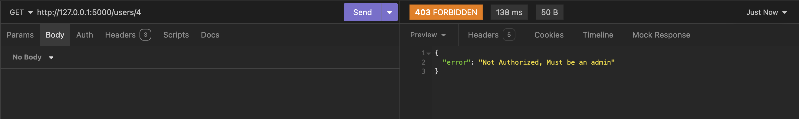

### Edit User

__Verb__: PATCH, PUT

__Path__: /users/<int: id>

__Header__: Valid JWT belonging to a user with admin privledges

__Body__: The admin can change any of the fields they wish to new values. For example, they can change a users password, email address, username etc

__Response__: A view of a specific user details excluding sensitive information such as password with a ```200``` response.

__Error__: An error occurs when a user without admin privledges tries to access this route. An error will also occur if the user does not exist. 

__Success__:

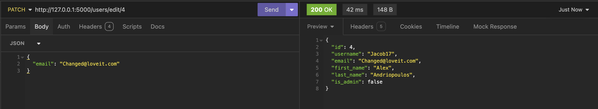

__Error__:

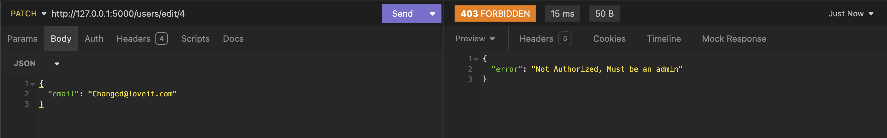

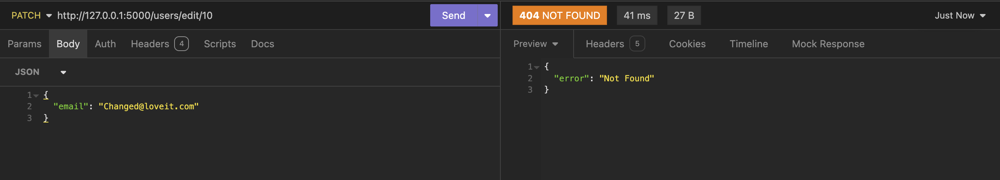

### Delete User

__Verb__: Delete

__Path__: /users/<int: id>

__Header__: Valid JWT belonging to a user with admin privledges

__Body__: N/A

__Response__: A success message confiriming deletion of a user will be returned to the user with a ```200``` response.

__Error__: An error occurs when a user without admin privledges tries to access this route. An error will also occur if the user does not exist.

__Success__:

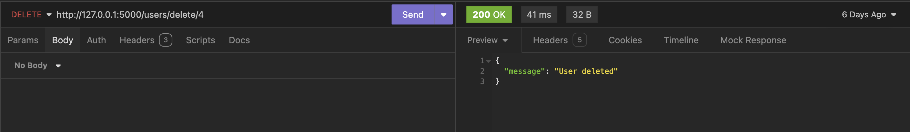

__Error__:

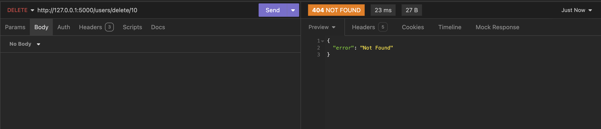

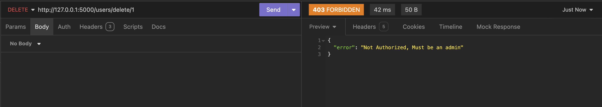

### Create User - Admin 

__Verb__: POST

__Path__: /users/create

__Header__: Valid JWT belonging to a user with admin privledges

__Body__: The admin will need to add an email, password longer than 10 chracters, first name, last name, username and admin privledges to the user. 

__Response__: A success message confiriming deletion of a user will be returned to the user with a ```200``` response.

__Error__: An error occurs when a user without admin privledges tries to access this route. An error will occur if any of the attributes of the user are missing from the body or the password is shorter than 10 characters. 

__Success__:

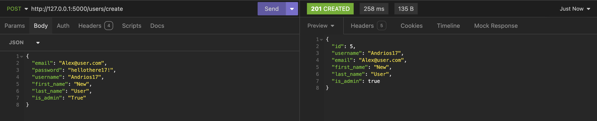

__Error__:

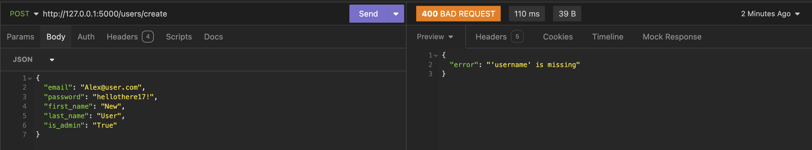

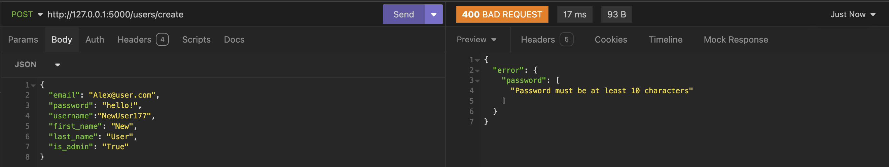

### Posts/Comments

### Create a post

__Verb__: POST

__Path__: /posts

__Header__: Valid JWT belonging to a user

__Body__: A title input is required and the post will not be created without it, a description key is optional.

__Response__: The post which has just been created will be returned to the user, and user information such as the user's username with a ```201``` response

__Error__: An error occurs when a user without a valid JWT tries to access the route, or a title has been neglected from the body. 

__Success__:

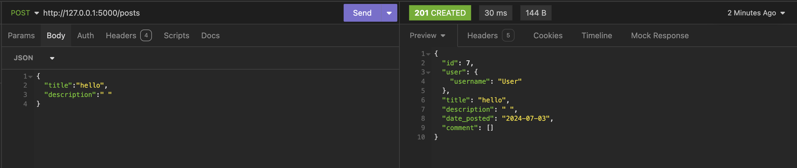

__Error__:

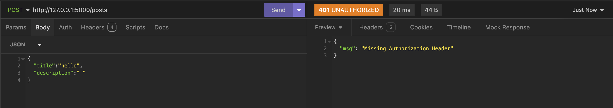

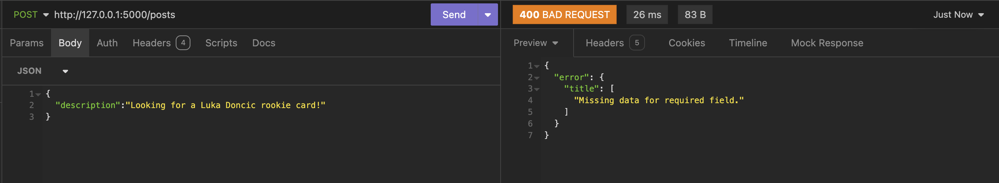

### Create a comment

__Verb__: POST

__Path__: /posts/comments/<int: id>

__Header__: Valid JWT belonging to a user

__Body__: A message input is required and the post will not be created without it.

__Response__: The comment which has just been created will be returned to the user, and user information such as username with a ```201``` response

__Error__: An error occurs when a user without a valid JWT tries to access the route, message has been omitted from the body or the post which the comment relates to does not exist.

__Success__:

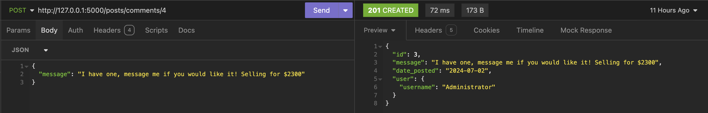

__Error__:

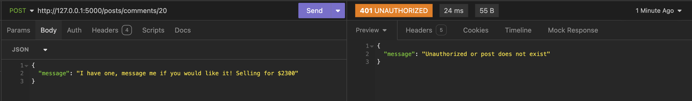

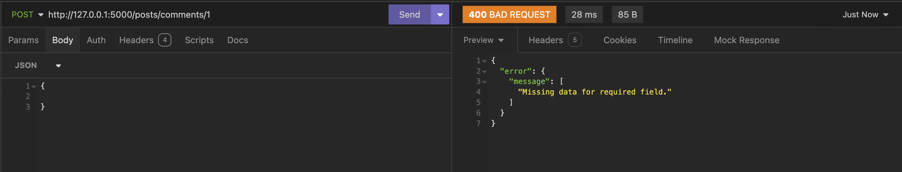

### Get all posts and related comments

__Verb__: GET

__Path__: /posts

__Header__: N/A

__Body__: N/A

__Response__: All posts stored in the database will be returned to the user, along with any associated comments with a ```200``` response

__Error__: No errors should persist on this route, however if no posts are stored in the database, the user will recieve this ```return {'message': 'No posts found'}, 200```

__Success__:

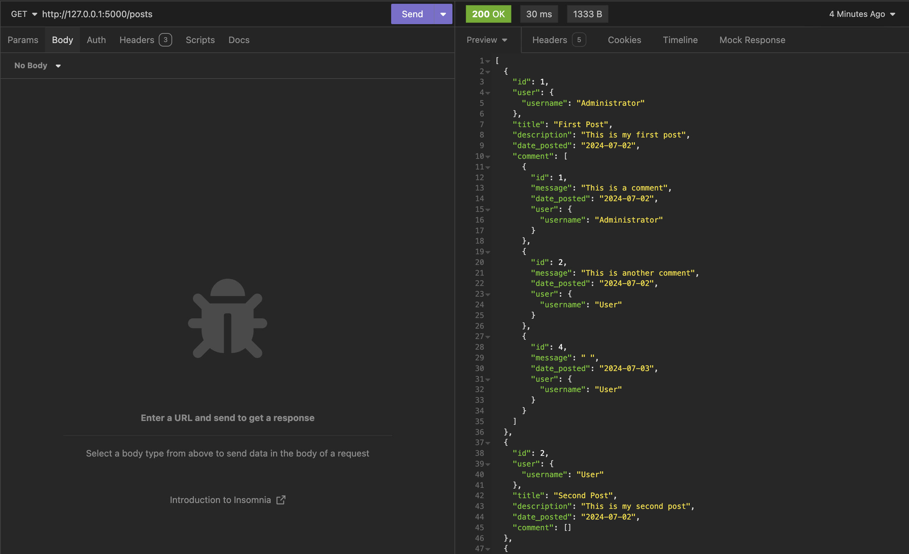

### Get a specific post and related comments

__Verb__: GET

__Path__: /posts/<int: id>

__Header__: N/A

__Body__: N/A

__Response__: The post which is entered into the url will be returned to the user, along with any related comments to the post. 

__Error__: An error message will occur if the user searches for a post which does not exist in the database. 

__Success__:

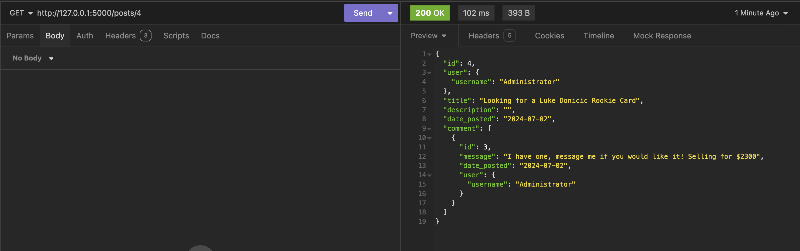

__Error__:
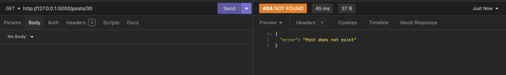

### Update a post 

__Verb__: PUT, PATCH

__Path__: /posts/<int: id>

__Header__: JWT associated with the original user who created the post or an administrator

__Body__: The user can edit either or the title attribute, or the description attribute of their original post. 

__Response__: The updated post, along with the original comments will be returned to the user with a ```200``` response

__Error__: An error message will occur if the user tries to update a post for which they are not the owner of/admin, the post they are trying to update does not exist or the title field is less than 10 characters.

__Success__

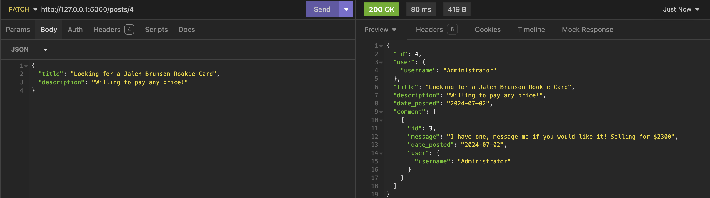

__Error__

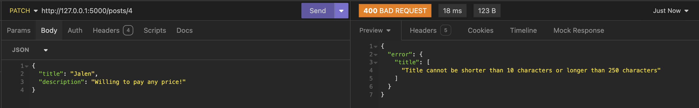


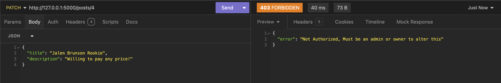

### Update a comment

__Verb__: PUT, PATCH

__Path__: /posts/comments/<int: post_id>/<int: comment_id>

__Header__: JWT associated with the original user who created the post or an administrator

__Body__: The user can edit either the message of the comment they are the owner of. 

__Response__: The updated comment with a ```200``` response

__Error__: An error message will occur if the user tries to update a comment for which they are not the owner of/admin or the comment does not exist. 

__Success__:
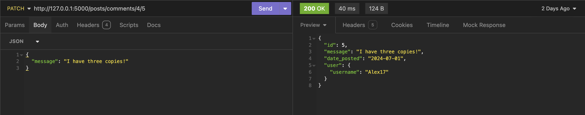

__error__:
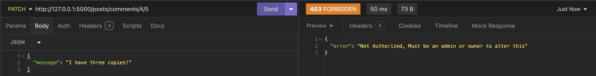


### Delete a Post

__Verb__: DELETE

__Path__: /posts/<int: post_id>/

__Header__: JWT associated with the original user who created the post or an administrator

__Body__: N/A

__Response__: Success message with a ```200``` response

__Error__: An error message will occur if the user tries to delete a post for which they are not the owner of/admin or the post does not exist.

__Success__:
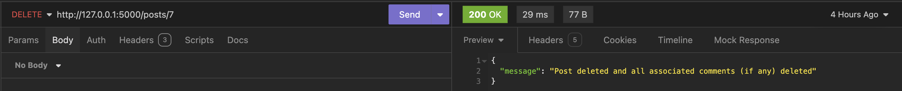

__Error__:

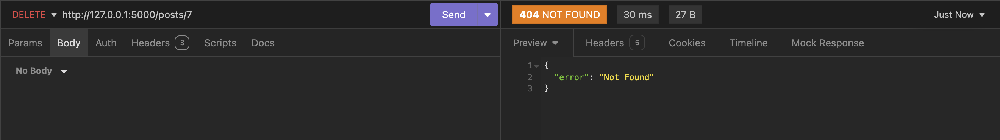

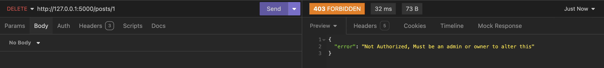

### Delete a Comment

__Verb__: DELETE

__Path__: /posts/comments/<int: post_id>/<int: comment_id>

__Header__: JWT associated with the original user who created the comment or an administrator

__Body__: N/A

__Response__: Success message with a ```200``` response

__Error__: An error message will occur if the user tries to delete a comment for which they are not the owner of/admin or the comment/post does not exist.

__Success__:
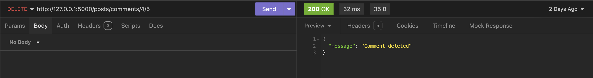

__error__:
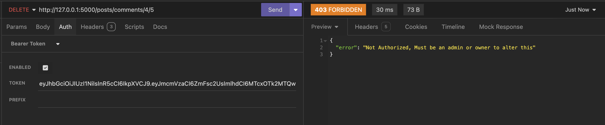

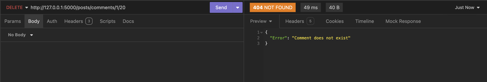

### Cards

### Get all cards in database

__Verb__: GET

__Path__: /posts/cards

__Header__: N/A

__Body__: N/A

__Response__: All cards in database should be returned with a ```200``` response

__Error__: Should be no expected errors as will also return the default seeded cards

__Success__:

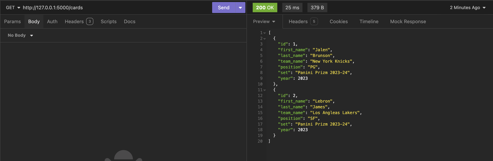

### Get a specific card 

__Verb__: GET

__Path__: /posts/cards/<int: id>

__Header__: N/A

__Body__: N/A

__Response__: The card will be displayed with a ```200``` response

__Error__: An error will occur if the user tries to enter a card which does not exist in the database. 

__Success__:
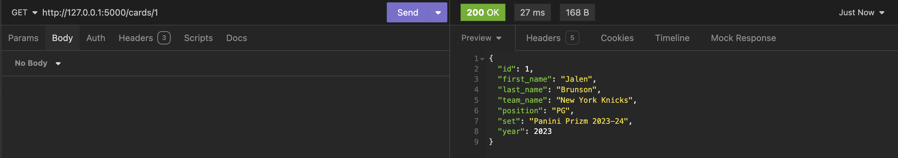

__Error__:
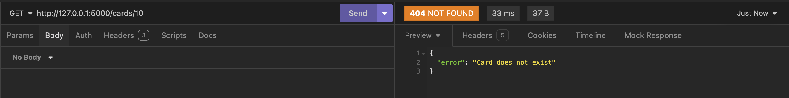

### Create a card 

__Verb__: POST

__Path__: /posts/cards

__Header__: JWT with a user who has admin privledges

__Body__: Enter the following attributes with corresponding data first_name, last_name, team_name, position, set, year. 

__Response__: The card will be displayed with a ```200``` response

__Error__: An error will occur if the user who is trying to access this route is not an admin, or has missed any filed required to create a card in this database. 

__Success__

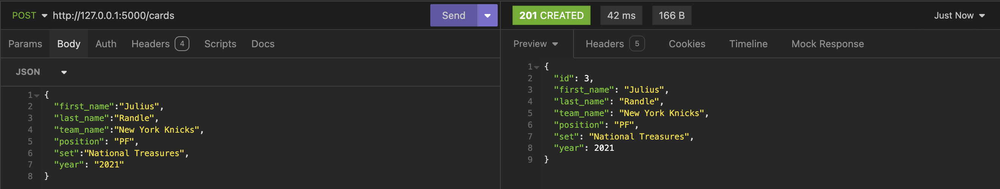

__Error__
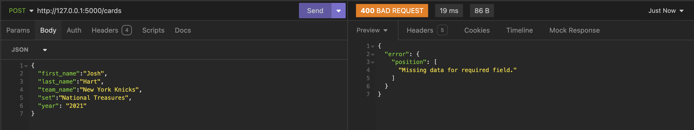

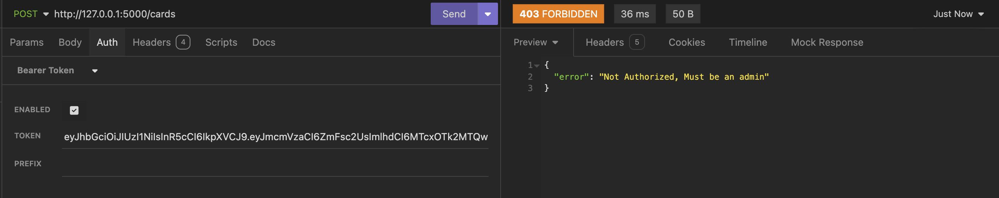

### Update a card

__Verb__: PUT, PATCH

__Path__: /posts/cards/<int: id>

__Header__: JWT with a user who has admin privledges

__Body__: Enter the card model attributes which you wish to edit.

__Response__: The updated card will be displayed with a ```200``` response

__Error__: An error will occur if the user who is trying to access this route is not an admin or the card does not exist

__Success__:
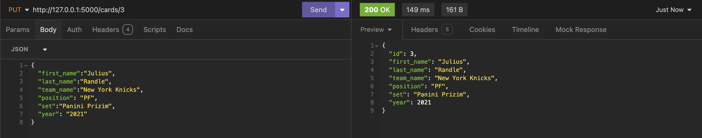

__Error__:

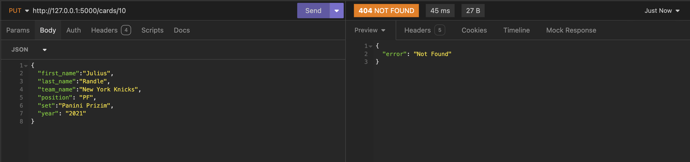

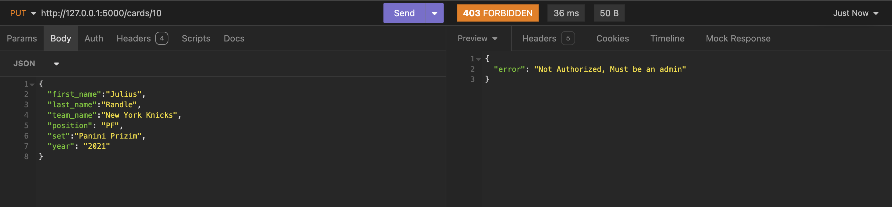

### Delete a card

__Verb__: DELETE

__Path__: /posts/cards/<int: id>

__Header__: JWT with a user who has admin privledges

__Body__: N/A

__Response__: A success message will be displayed with a ```200``` response

__Error__: An error will occur if the user who is trying to access this route is not an admin or the card does not exist. 

__Success__:

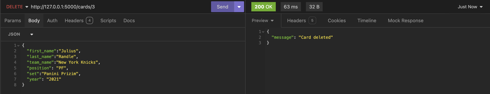

__Error__:

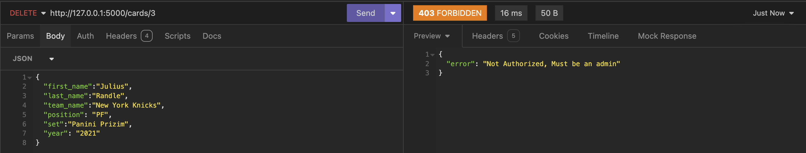

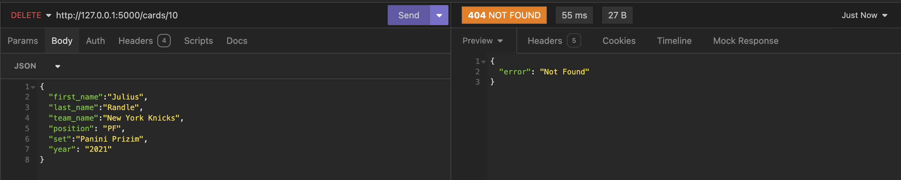

### Personal Collections

### Viewing your own personal collection

__Verb__: GET

__Path__: /personal_collection

__Header__: JWT of a valid user

__Body__: N/A

__Response__: All cards in the users personal collection will be displayed with a ```200``` response

__Error__: An error will occur if the user who is trying to access this route is not a registered user. If there are no  cards in the personal collection, it will display the following message: ```{'message': 'You do not have any cards in your collection'}, 200```

__Success__:

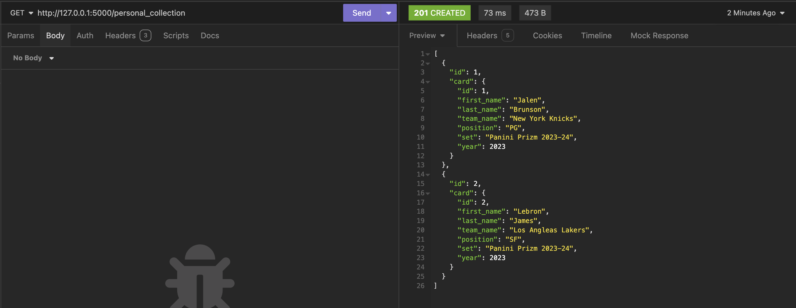

__Error__:

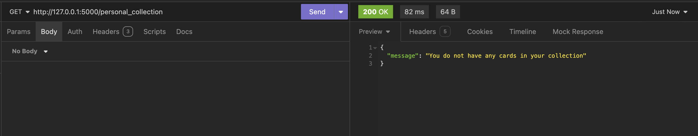

### Get another users personal collection

__Verb__: GET

__Path__: /personal_collection/<int: id>

__Header__: JWT of a valid user

__Body__: N/A

__Response__: All cards in the specified users personal collection will be displayed with a ```200``` response

__Error__: An error will occur if the user who is trying to access this route is not a registered user. If there are no cards in the personal collection, it will display the following message: ```{'message': 'This user does not have any cards in their collection'}, 404```

__Success__:

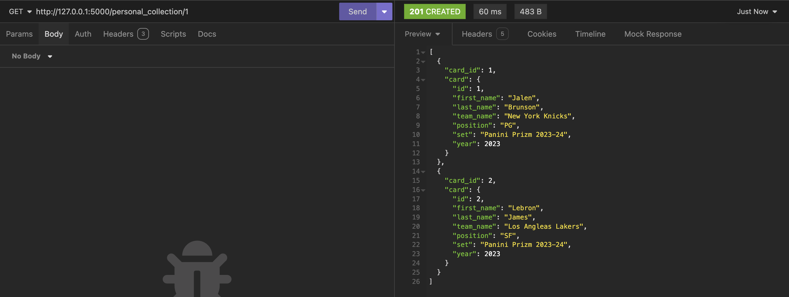

__Error__:

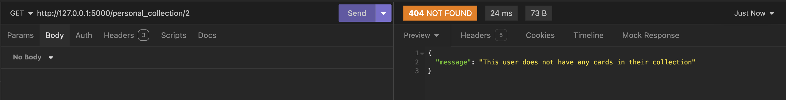

### Create entries in personal collection

__Verb__: POST

__Path__: /personal_collection

__Header__: JWT of a valid user

__Body__: The user will need to enter the atrribute ```card_id``` which corresponds to the cards stored in the database to add this card to their personal collection. 

__Response__: A display of the attributes of the cards that have just been added along with ```200``` response

__Error__: An error will occur if the user who is trying to access this route is not a registered user, if the user enters the wrong type of data or if the card does not exist in the database. 

__Success__:

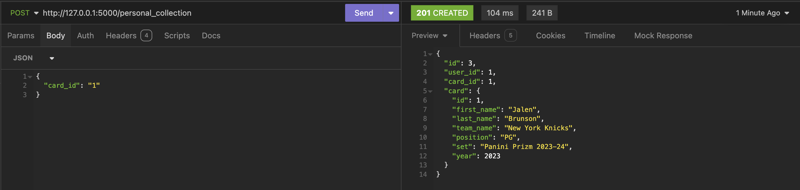

__Error__:

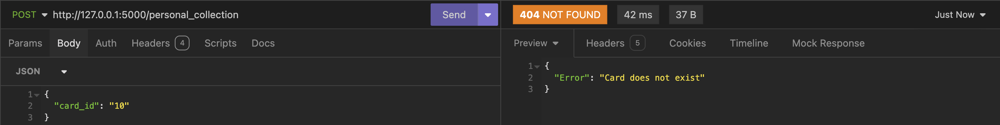

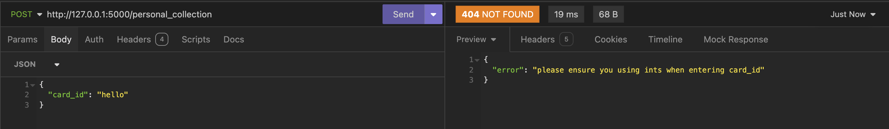

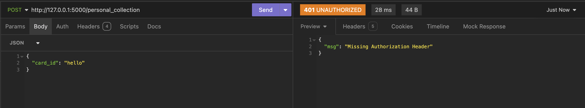


### Delete Entries in Personal Collection

__Verb__: DELETE

__Path__: /personal_collection/<int:id>

__Header__: JWT matching the identity of the owner of the pc referenced or an admin

__Body__: N/A

__Response__: A success message notifying the user the card has been deleted along with ```200``` response

__Error__: An error will occur if the user who is trying to access this route is not a registered owner/admin or if the entry which is trying to be deleted. 

__Success__:

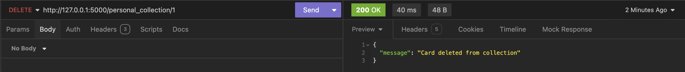

__Error__:

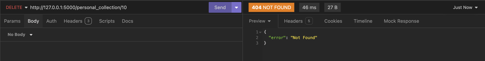

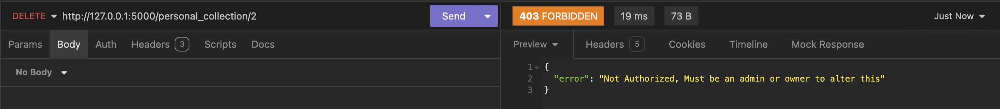

### Auctions and Bids

### Get all auctions and associated bids

__Verb__: GET

__Path__: /auction

__Header__: N/A

__Body__: N/A

__Response__: All auctions and associated bids will be displayed to the user along with ```200``` response

__Error__: No expected errors on this route as the seeded inputs will always be displayed in every circumstance. 

__Success__:
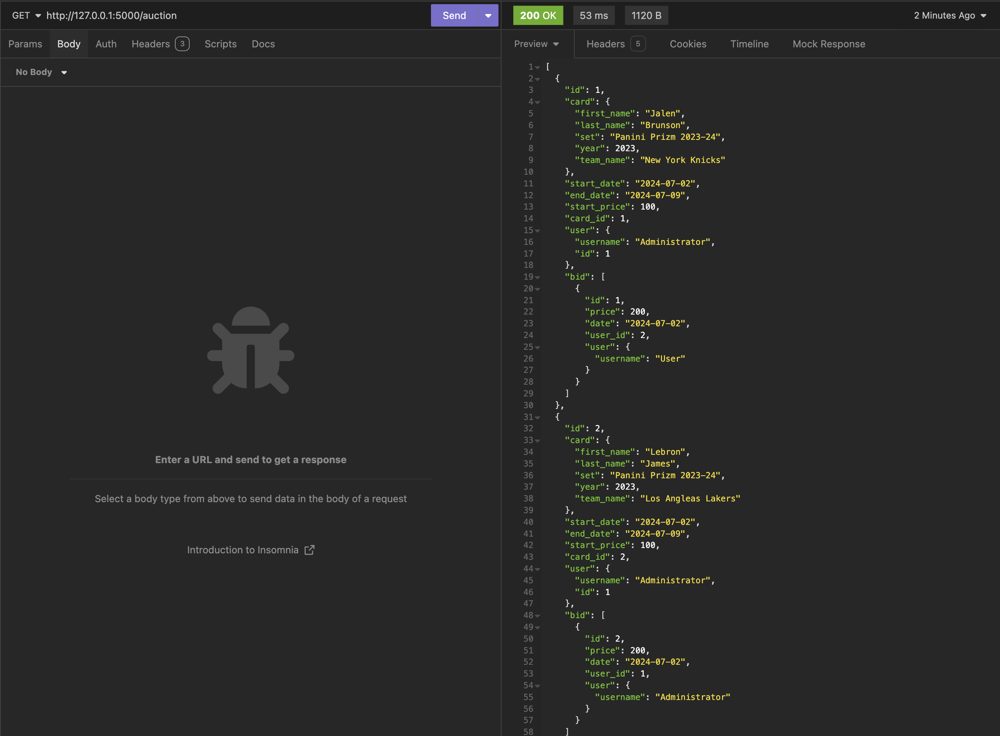

### Get a specific auction and associated bids

__Verb__: GET

__Path__: /auction/<ind: auction_id>

__Header__: N/A

__Body__: N/A

__Response__: The auction and associated bids will be displayed to the user along with ```200``` response

__Error__: If the user enters an auction_id which does not exist, the will be fronted with a ```404 status code``` along with a message stating the auction does not exits. 

__Success__:

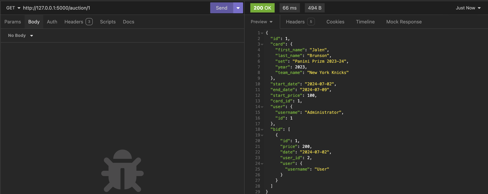

__Error__:

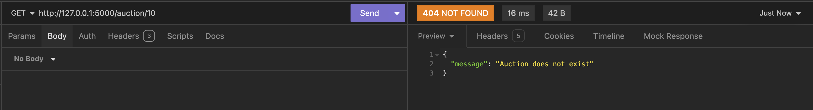

### Get all auctions for a specific card

__Verb__: GET

__Path__: /auction/card/<ind: card_id>

__Header__: N/A

__Body__: N/A

__Response__: All auctions and associated bids for the desired card will be displayed to the user along with ```200``` response

__Error__: If the user enters a card_id which does not exist, they will be fronted with a ```404 status code``` along with a message stating the card cannot be found. If the card does exist, however, there are no auction for it currently, they will be displayed with the following message ```{'message': 'No auctions found for this card'}, 200```

__Success__:

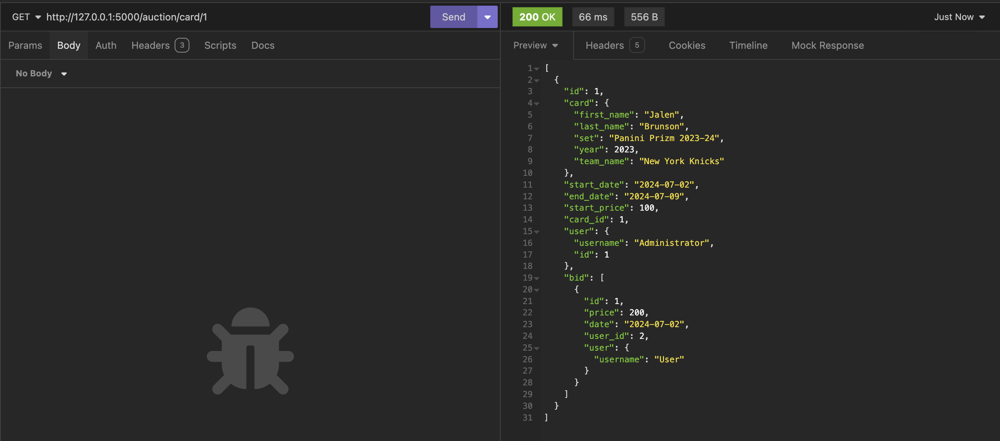

__Error__:

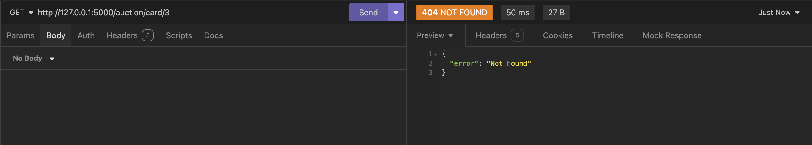

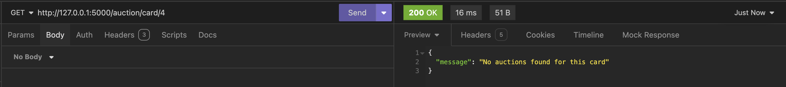